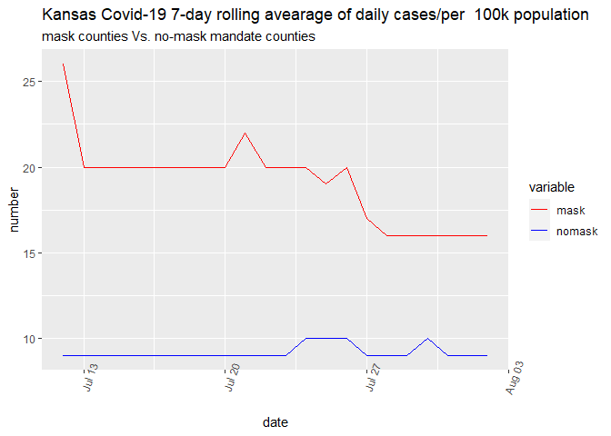

Lab 07 - Conveying the right message through visualisation
================
Insert your name here
Insert date here

### Load packages and data

## 1, 2

``` r
library(tidyverse) 
```

``` r
df <- tribble(
  ~date, ~mask, ~nomask,
  "7/12/2020", 26,9,
  "7/13/2020", 20,9,
  "7/14/2020", 20,9,
  "7/15/2020", 20,9,
  "7/16/2020", 20,9, 
  "7/17/2020", 20,9,
  "7/18/2020", 20,9,
  "7/19/2020", 20,9,
  "7/20/2020", 20,9,
  "7/21/2020", 22,9,
  "7/22/2020", 20,9,
  "7/23/2020", 20,9,
  "7/24/2020", 20,10,
  "7/25/2020", 19,10,
  "7/26/2020", 20,10,
  "7/27/2020", 17,9,
  "7/28/2020", 16,9,
  "7/29/2020", 16,9,
  "7/30/2020", 16,10,
  "7/31/2020", 16,9,
  "8/1/2020", 16,9,
  "8/2/2020", 16,9,
  )

df$date<-as.Date(df$date, format="%m/%d/%Y")
```

``` r
library(reshape2)
```

    ## 
    ## Attaching package: 'reshape2'

    ## The following object is masked from 'package:tidyr':
    ## 
    ##     smiths

``` r
#prepare for the plot

df_melt<-melt(df, id.vars="date")

df_melt %>%
  ggplot(aes(x=date,y=value, color=variable))+
  geom_line()+
  scale_color_manual(values = c("red", "blue"))+
  theme(axis.text.x=element_text(angle=70)) +
  labs(title= "Kansas Covid-19 7-day rolling avearage of daily cases/per  100k population", subtitle="mask counties Vs. no-mask mandate counties", x= "date", y="number")
```

<!-- --> \`\`\`

## 3, 4

the scale is really weired in given graph. in the original plot, the y
scale does not make sence. In my plot, I make the same scale.

It is hard to make that kind of inference because this data is not
enough, and I think inference test is required to draw some conlcusion.
