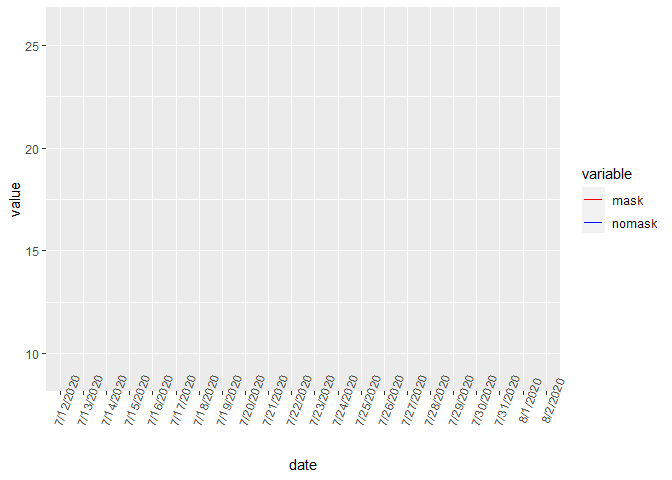

Lab 07 - Conveying the right message through visualisation
================
Insert your name here
Insert date here

### Load packages and data

## 1, 2

``` r
library(tidyverse) 
```

``` r
df <- tribble(
  ~date, ~count1, ~count2,
  "1/1/2020", 15,25,
  "2/1/2020", 20,22,
  "3/1/2020", 22,21,
  "4/1/2020", 19,27,
  "5/1/2020", 23,22, 
  "6/1/2020", 25,29,
  
)

print(df)
```

    ## # A tibble: 6 x 3
    ##   date     count1 count2
    ##   <chr>     <dbl>  <dbl>
    ## 1 1/1/2020     15     25
    ## 2 2/1/2020     20     22
    ## 3 3/1/2020     22     21
    ## 4 4/1/2020     19     27
    ## 5 5/1/2020     23     22
    ## 6 6/1/2020     25     29

``` r
df %>%
  ggplot(aes(x=date,y=count1, group=1))+
  geom_line(color="blue") +
  geom_line(aes(x=date,y=count2, group=1),color="red")+
  labs(x="Date", y="count 1 & 2") 
```

<!-- -->

## 3, 4

the scale is really weired in given graph.

## further Graph.

``` r
# chage date column  (character class into Date class)
df$date<-as.Date(df$date, format="%m/%d/%Y")

library(reshape2)
```

    ## 
    ## Attaching package: 'reshape2'

    ## The following object is masked from 'package:tidyr':
    ## 
    ##     smiths

``` r
df_melt<-melt(df, id.vars="date")

df_melt %>%
  ggplot(aes(x=date,y=value, color=variable))+
  geom_line()+
  scale_color_manual(values = c("red", "blue"))
```

<!-- -->
